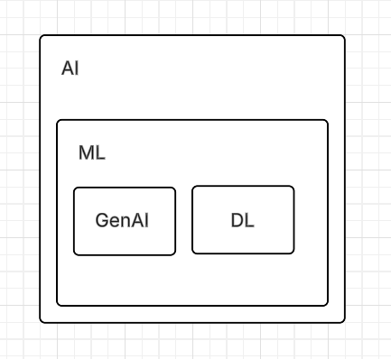
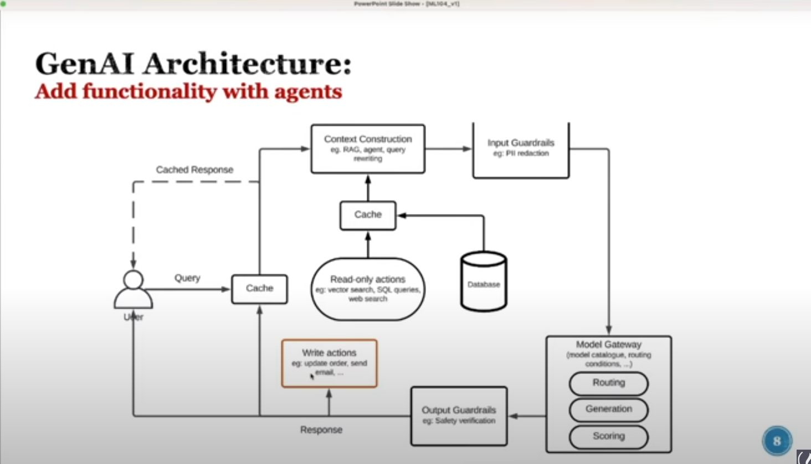

# Generative AI Learning Summary

This repository contains a summary of foundational concepts in Generative AI, its place within the broader field of data and computer science, and the common architectures used to build powerful AI applications.

---

## 1. The Big Picture: A Hierarchy of Intelligence

We started by defining the key terms and understanding how they relate to one another. The relationship can be understood as a series of nested subsets, each a specialization of the last, with Data Science being an overlapping, interdisciplinary field.

* **Artificial Intelligence (AI):** The broadest field, encompassing the entire concept of creating machines that can simulate human intelligence, reasoning, and learning.

* **Machine Learning (ML):** A fundamental subset of AI where systems learn patterns from data without being explicitly programmed.

* **Deep Learning (DL):** A specialized subfield of ML that uses complex, multi-layered "neural networks" to learn from vast amounts of data. It is the engine behind most modern AI breakthroughs.

* **Generative AI:** A category of AI, typically powered by Deep Learning models, focused on *creating new, original content* (text, images, code, etc.) rather than just classifying or predicting existing data.

* **Data Science:** An interdisciplinary field that uses AI, ML, and statistical methods to extract insights and knowledge from data. Its primary goal is to inform decision-making by analyzing and interpreting data.

---

## 2. Core GenAI Architectures

We then explored two common architectural patterns for building Generative AI applications.

### a. Basic Architecture: Retrieval-Augmented Generation (RAG)

The first architecture focuses on enhancing a model's response by providing it with relevant, external information at the time of the query. This prevents the model from relying solely on its pre-trained knowledge and allows it to use up-to-date or private data.

**Workflow:**

1.  **User Query:** The user asks a question.
2.  **Context Construction:** The system searches external data sources (databases, documents, web) for information relevant to the query.
3.  **Augmented Prompt:** The retrieved information ("context") is combined with the original query.
4.  **Model Generation:** This combined prompt is sent to the AI model, which generates an answer based on the provided context.
5.  **Response:** The final, context-aware answer is returned to the user.

### b. Advanced Architecture: Adding Functionality with Agents

The second, more advanced architecture gives the AI system the ability to not only *read* information but also *take action* and interact with other systems. It introduces concepts like agents, safety guardrails, and intelligent model management.

**Key Additions & Workflow:**

* **Agents:** A smart component that analyzes the user's query and creates a multi-step plan. It can decide whether to read data, write data, or use other tools.
* **Write Actions:** The ability to perform tasks that change data, such as canceling an order, sending an email, or updating a database record.
* **Guardrails (Input/Output):** Security checks that scan both the user's query and the AI's final response for safety, privacy (PII), and compliance.
* **Model Gateway:** A sophisticated system that can route requests to different AI models, score the quality of generated responses, and manage the overall interaction with the AI.
* **Caching:** A memory system to store recent results, improving speed and efficiency for repeated queries.

