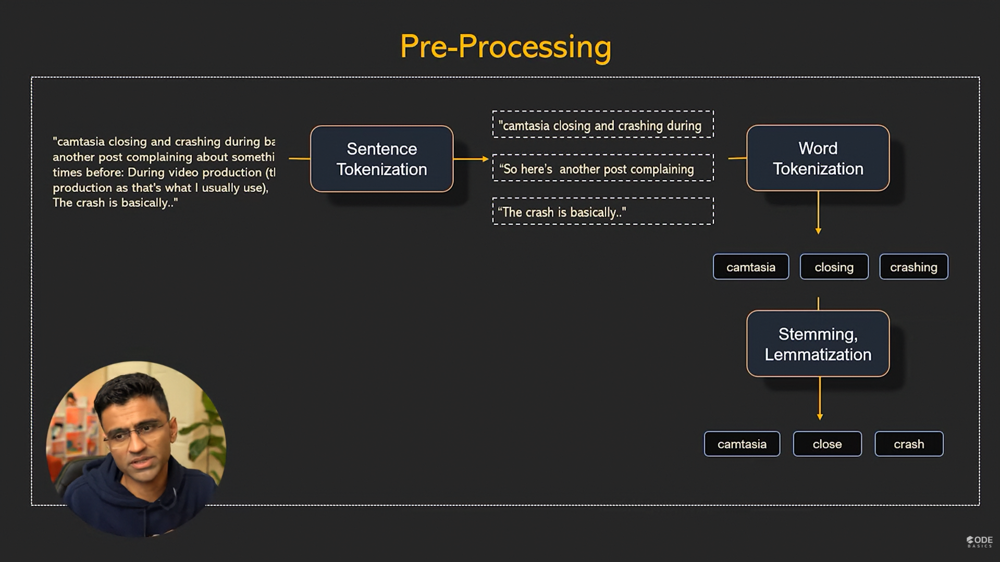
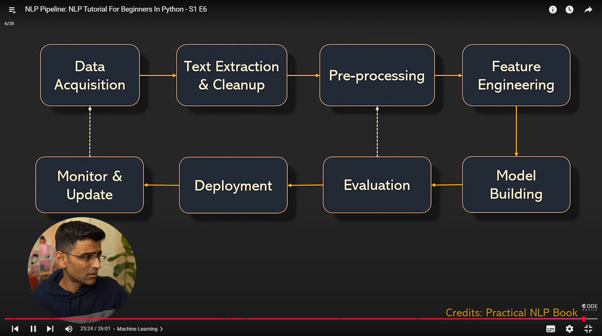

Of course. The **NLP Pipeline** is a standard sequence of steps or stages that you follow to build any system that works with text data. It provides a structured workflow, moving from raw, unstructured text to a trained machine learning model that can perform a specific task.

Here is a breakdown of the typical NLP pipeline, along with a diagram illustrating the flow.

### The NLP Pipeline Stages

#### 1. Data Collection (Text Acquisition)
This is the starting point. You gather the raw text data required for your specific NLP task.
* **Sources:** Web scraping, APIs (like Twitter), public datasets (like Wikipedia), internal documents, or user-generated content.

#### 2. Text Preprocessing (Text Cleaning)
Raw text is messy and needs to be cleaned and standardized. This is often the most time-consuming but critical stage.
* **Common Tasks:**
    * **Tokenization:** Breaking text into individual words or sentences.
    * **Lowercasing:** Converting all text to lowercase.
    * **Stop Word Removal:** Removing common words (`a`, `the`, `in`).
    * **Punctuation Removal:** Removing characters like `.,?!`.
    * **Stemming/Lemmatization:** Reducing words to their root form (e.g., "running" -> "run").

#### 3. Feature Engineering (Text Representation)
Machine learning models cannot understand raw text; they require numerical input. This stage converts the cleaned text into numbers.
* **Common Techniques:**
    * **Bag-of-Words (BoW):** Counting word frequencies.
    * **TF-IDF:** Scoring words based on their importance in a document.
    * **Word Embeddings:** Representing words as dense vectors (e.g., Word2Vec, GloVe).
    * **Contextual Embeddings:** Advanced vector representations that understand context (e.g., BERT, RoBERTa).
    

#### 4. Model Building (Training)
Here, you select a machine learning or deep learning model and train it on your prepared numerical data.
* **Model Choice Depends on the Task:**
    * **Classification:** Naive Bayes, SVM, Logistic Regression, Recurrent Neural Networks (RNNs), Transformers (BERT).
    * **Sequence Labeling (NER):** Conditional Random Fields (CRF), Bi-LSTM.
    * **Generation (Translation/Summarization):** Sequence-to-Sequence models, Transformers (GPT, T5).

#### 5. Model Evaluation
After training, you must assess how well your model performs on new, unseen data to ensure it generalizes well.
* **Common Metrics:**
    * **Accuracy:** Overall correct predictions.
    * **Precision & Recall:** Measure of relevance and completeness.
    * **F1-Score:** The harmonic mean of Precision and Recall.
    * **BLEU/ROUGE:** For translation and summarization tasks.

#### 6. Model Deployment & Monitoring
Once you are satisfied with the model's performance, you deploy it into a production environment where it can be used by applications. You then monitor its performance over time.
* **Deployment:** Making the model available via an API.
* **Monitoring:** Tracking the model's accuracy and retraining it with new data as needed.

---

### Diagram of the NLP Pipeline

This diagram shows how the stages flow logically from raw text to a functional, deployed model.

