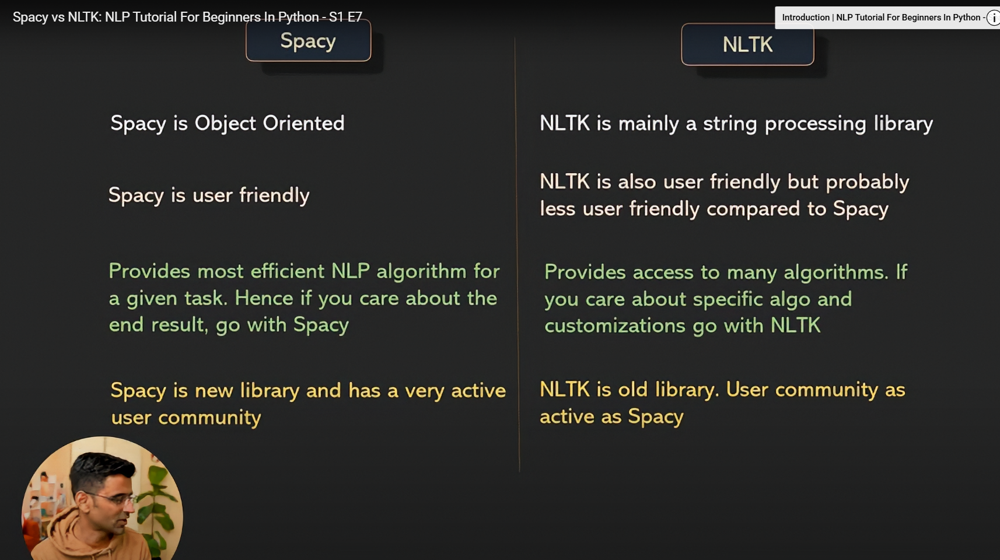

spaCy and NLTK are both powerful Python libraries for Natural Language Processing, but they are designed with different goals in mind. **The primary difference is that spaCy is built for production-ready applications, while NLTK is a comprehensive toolkit ideal for learning and research.**

Here’s a breakdown of their key differences:

---

### ## spaCy 🚀

**spaCy** is a modern and opinionated library designed to be fast, efficient, and easy to use for building real-world products.

* **Focus:** **Production & Performance.** It's designed to do one thing for each NLP task and do it well. It provides a clear, optimized path to get a job done.
* **Ease of Use:** Very user-friendly. It comes with pre-trained statistical models that are easy to download and use, allowing you to get state-of-the-art results quickly.
* **Performance:** Written in Cython, spaCy is extremely fast and memory-efficient, which is crucial for handling large volumes of text in a production environment.
* **Features:** Provides a comprehensive set of tools for a typical NLP pipeline, including tokenization, part-of-speech (POS) tagging, named entity recognition (NER), and dependency parsing. It also has excellent support for word vectors.
* **Best For:**
    * Building applications that need to process a lot of text quickly.
    * Web apps, chatbots, and other production systems.
    * Developers who need a straightforward, "get-it-done" library.

---

### ## NLTK (Natural Language Toolkit) 📚

**NLTK** is an older, more established library that is often called a "Swiss Army knife" for NLP. It's incredibly comprehensive and serves as a fantastic platform for academic and research purposes.

* **Focus:** **Research & Education.** It provides a massive collection of algorithms, models, and text corpora, giving you the flexibility to experiment with many different methods.
* **Ease of Use:** It has a steeper learning curve than spaCy. Because it offers so many choices, you often have to combine different components to build a full pipeline.
* **Performance:** NLTK is generally slower than spaCy as it's written in pure Python and prioritizes flexibility over speed.
* **Features:** Its biggest strength is its breadth. It contains implementations of countless algorithms, from tokenizers and stemmers to parsers and semantic reasoners. It's a great tool for understanding the building blocks of NLP.
* **Best For:**
    * Learning NLP concepts from the ground up.
    * Academic research and experimentation with various algorithms.
    * When you need access to a specific, less common algorithm that spaCy doesn't offer.

---

### ## Key Takeaways

| Feature | spaCy | NLTK |
| :--- | :--- | :--- |
| **Primary Goal** | Production-ready applications | Education and research |
| **Speed** | 🚀 **Fast** (Cython) | 🐢 **Slower** (Python) |
| **Approach** | Opinionated (one best way) | Flexible (many options) |
| **Ease of Use** | Easy, integrated pipelines | Steeper learning curve |
| **Models** | Pre-trained, optimized models | Provides building blocks |
| **Algo** | Only One | Many Algo |

**Conclusion:** If you're a beginner wanting to build something that works well out-of-the-box or a developer creating a production application, **start with spaCy**. If you're a student or researcher wanting to explore the nuances of NLP and experiment with different algorithms, **NLTK is the perfect choice.**