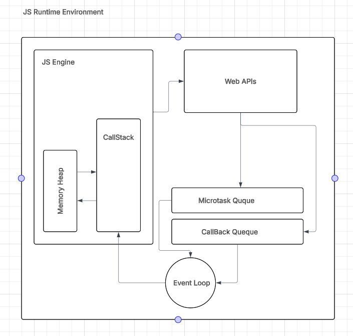

# The Journey of JavaScript: A Deep Dive into the Runtime Environment 🚀

Welcome! This document is a guide to understanding what happens "behind the scenes" when you run JavaScript code. Grasping these concepts is the key to moving from a beginner to an advanced JS developer.

We'll trace the path of your code from the moment it's loaded to the moment it's executed, explaining all the major components involved.


---

## ## 🏛️ The Core Components

A JavaScript runtime environment (like a browser or Node.js) is more than just the JS Engine. It's an ecosystem of components working together. Here are the main players:

* **JavaScript Engine:** The heart of the runtime. Its job is to parse, compile, and execute your code. The most famous one is Google's **V8** (used in Chrome and Node.js).
* **Web APIs / C++ APIs:** These are features provided by the *environment* (the browser or Node.js), not the JS Engine itself. They handle things JavaScript can't do on its own, like making HTTP requests (`fetch`), setting timers (`setTimeout`), or interacting with the file system.
* **The Event Loop:** The great orchestrator. It's a simple process that constantly checks if the Call Stack is empty and, if it is, pushes tasks from the Queues onto the stack.
* **Callback Queue (or "Task Queue"):** A waiting area for callback functions from Web APIs like `setTimeout` or DOM events (`click`, `scroll`). It's a **FIFO** (First-In, First-Out) queue.
* **Microtask Queue (or "Job Queue"):** A special, high-priority waiting area. Callbacks from Promises (`.then()`, `.catch()`, `.finally()`) and `queueMicrotask()` go here.

---

## ## 📜 The Step-by-Step Execution Flow

Let's follow a piece of code on its journey.

### ### Step 1: Parsing & Compilation

When the engine receives your script, it doesn't just run it.

1.  **Tokenizing:** The engine reads your code character by character and breaks it down into atomic pieces called "tokens" (e.g., `const`, `myVar`, `=`, `10`).
2.  **Parsing:** These tokens are then organized into a tree-like structure called an **Abstract Syntax Tree (AST)**. The AST represents the grammatical structure of your code.
3.  **Compilation / Interpretation:** The JS engine takes this AST and converts it into machine-readable code. Modern engines like V8 use a **Just-In-Time (JIT)** compiler:
    * It first uses an **interpreter** (called `Ignition` in V8) to quickly convert the AST to bytecode and execute it.
    * While running, the engine's **profiler** watches for "hot" code—functions that are run frequently.
    * This hot code is passed to an **optimizing compiler** (called `TurboFan` in V8), which produces highly optimized machine code that runs much faster.

### ### Step 2: Synchronous Execution & The Call Stack

As your code is executed, the engine uses a **Call Stack** to keep track of where it is. The Call Stack is a **LIFO** (Last-In, First-Out) structure.

* When a function is called, a "stack frame" is **pushed** onto the top of the stack.
* When a function returns, its frame is **popped** off the stack.
* All synchronous code runs on this single Call Stack. A `console.log('Hello')` is pushed, executed, and popped immediately.

```javascript
function first() {
  console.log('First!');
}
function second() {
  first();
  console.log('Second!');
}
second();

// Call Stack Trace:
// 1. second() is pushed.
// 2. first() is pushed.
// 3. console.log('First!') is pushed, executed, popped.
// 4. first() returns and is popped.
// 5. console.log('Second!') is pushed, executed, popped.
// 6. second() returns and is popped.
```

### ### Step 3: The World of Web APIs (Asynchronous Code)

What happens when the engine encounters something like `setTimeout` or `fetch`?

1.  **Hand-off:** The JS Engine does **not** handle these tasks. It recognizes them as Web APIs and hands them off to the browser to manage.
2.  **No Blocking:** The key here is that JavaScript **does not wait**. It hands off the task and immediately moves on to the next line of synchronous code. This is why JavaScript is called "non-blocking."

For example, when `setTimeout(myCallback, 2000)` is executed:
* `setTimeout` is pushed onto the Call Stack.
* The engine sees it's a Web API and hands the `myCallback` function and the `2000ms` timer to the browser's Timer API.
* `setTimeout` is immediately **popped** from the Call Stack.
* The browser starts a 2-second countdown completely outside of the JS Engine.

### ### Step 4: The Queues - The Waiting Room

Once the browser finishes its task (the 2-second timer is up, or the `fetch` request gets a response), the associated callback function isn't executed immediately. It's placed in a waiting line.

* Callbacks from `setTimeout`, DOM events, `setInterval`, etc., go into the **Callback Queue**.
* Callbacks from Promises (`.then`, `.catch`) go into the **Microtask Queue**.

> **Key Difference:** The Microtask Queue has a higher priority than the Callback Queue.

### ### Step 5: The Event Loop - The Great Orchestrator

The Event Loop has one simple but crucial job: to constantly monitor the Call Stack and the Queues. It follows these rules:

1.  **Is the Call Stack empty?** If not, it does nothing. It waits until all synchronous code has finished running.
2.  **If the Call Stack is empty, are there any tasks in the Microtask Queue?**
    * If yes, it takes **ALL** tasks from the Microtask Queue, one by one, and pushes them onto the Call Stack to be executed. It will continue doing this until the Microtask Queue is completely empty.
3.  **If the Call Stack and Microtask Queue are both empty, is there anything in the Callback Queue?**
    * If yes, it takes the **oldest** task (just one!) from the Callback Queue, pushes it onto the Call Stack, and it gets executed.

This loop repeats indefinitely, ensuring your asynchronous code gets executed at the right time without blocking the main thread.

---

## ## 🧠 The Unseen Helper: Garbage Collection

JavaScript has **automatic memory management**. As you create variables, objects, and functions, the engine allocates memory for them. But what happens when you no longer need them?

That's where the **Garbage Collector (GC)** comes in. Its job is to periodically scan the memory and free up space occupied by "garbage"—objects that are no longer reachable or usable by the program.

The most common algorithm is called **Mark-and-Sweep**:
1.  **Root:** The GC starts with a set of "root" objects (like the global object).
2.  **Mark:** It follows all references from the roots and "marks" every object it can find as "reachable" (in use).
3.  **Sweep:** It then sweeps through all the memory. Any object that was not marked is considered garbage and its memory is reclaimed.

This process happens automatically, preventing memory leaks and keeping your application healthy.

---



## ## ✨ Putting It All Together: A Code Example

Let's see the final execution order of this code snippet:

```javascript
console.log('A: Sync Start'); // 1

setTimeout(() => {
  console.log('B: setTimeout Callback'); // 5
}, 0);

Promise.resolve().then(() => {
  console.log('C: Promise Microtask 1'); // 3
}).then(() => {
  console.log('D: Promise Microtask 2'); // 4
});

console.log('E: Sync End'); // 2
```

### Execution Analysis:

1.  **`A: Sync Start`** is logged.
2.  `setTimeout` is handed to the Web API. The browser will place its callback in the **Callback Queue** after 0ms.
3.  `Promise.resolve()` creates a resolved promise. Its `.then()` callback is immediately placed in the **Microtask Queue**.
4.  **`E: Sync End`** is logged.
5.  The Call Stack is now **empty**. The Event Loop runs.
6.  **Event Loop Check 1:** It sees the Microtask Queue has tasks. It pushes `C`'s callback to the stack.
7.  **`C: Promise Microtask 1`** is logged. This `.then()` returns another promise, so its subsequent `.then()` (for `D`) is added to the **Microtask Queue**.
8.  **Event Loop Check 2:** The Call Stack is empty again. It checks the Microtask Queue again and finds `D`'s callback. It pushes it to the stack.
9.  **`D: Promise Microtask 2`** is logged.
10. **Event Loop Check 3:** The Call Stack is empty. The Microtask Queue is empty. Now, it finally checks the **Callback Queue**. It finds the `setTimeout` callback. It pushes it to the stack.
11. **`B: setTimeout Callback`** is logged.

**Final Output:**
```
A: Sync Start
E: Sync End
C: Promise Microtask 1
D: Promise Microtask 2
B: setTimeout Callback
```

And that is the complete journey of your JavaScript code through its runtime environment!