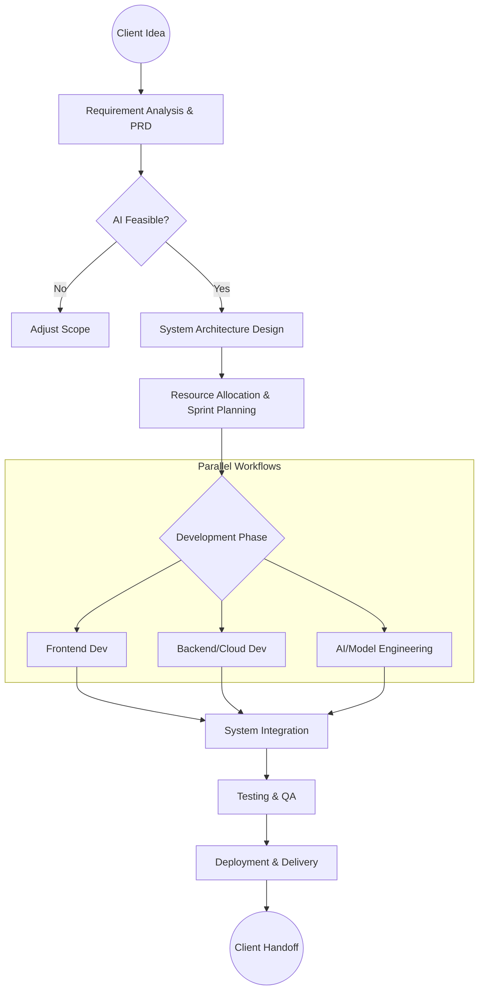

To help you "deconstruct" (break down) a vague client idea into a successful Full Stack AI project, we need a structured workflow. Since you are in a management role, your focus shifts from just *coding* to *orchestrating* the entire system.

Here is the best approach to managing this lifecycle, followed by the visual diagram you requested.

### Phase 1: The Deconstruction (Discovery)

Before writing a single line of code, you must translate "business talk" into "technical specs."

* **Requirement Gathering:** Ask the client *why* they need this. (e.g., "We need an AI chatbot" -> "We actually need to reduce customer support ticket volume by 30%").
* **Feasibility Study:** Can this actually be done with current AI? (e.g., Is there a model on Hugging Face that can do this, or do we need to train one from scratch?).
* **The PRD (Product Requirement Document):** Create a document listing every feature.

### Phase 2: Architecture & Design

This is where you define the skeleton.

* **Tech Stack:** Decide the tools. (e.g., Frontend in React, Backend in Python/FastAPI for AI handling, Cloud on AWS).
* **Data Flow:** How does data move from the user to the AI and back?

### Phase 3: Resource Management & Team Division

You asked specifically about how to divide tasks. In a Full Stack AI project, you generally need three distinct "lanes" of work running in parallel.

| Role | Responsibilities | Key Tasks |
| --- | --- | --- |
| **Frontend Team** | User Interface (UI) | Building the dashboard, handling user inputs, visualizing AI results. |
| **Backend/DevOps** | Infrastructure & API | Setting up the database, creating APIs, managing AWS/Cloud, ensuring security. |
| **AI/Data Team** | The "Brain" | Data cleaning, prompt engineering, model selection (e.g., Gemini/OpenAI), and fine-tuning. |

---

### Visual Diagram: The Project Development Approach

Here is a flowchart illustrating how to move from a Client Idea to Deployment.

### Detailed Breakdown of the Flow

**1. Requirement Analysis (The "What")**

* **Input:** Client says, "I want an app that reads invoices."
* **Your Job:** Define the scope. Does it need to read handwritten text? specific formats? (This reminds me of the specificity you used when defining your "Solid State" chemistry extraction project—detailed constraints are key).

**2. Resource Allocation (The "Who")**

* **Frontend:** Assign 1-2 developers to build the screens. They don't need to know how the AI works; they just need to know what the API response looks like (e.g., JSON format).
* **Backend:** Assign developers to build the bridge. They ensure the frontend can talk to the database and the AI service securely.
* **AI Engineers:** This is a separate track. While the app is being built, they are testing prompts and models (like you did with Hugging Face) to ensure accurate results.

**3. Integration (The "Merge")**

* This is the most critical step. The Frontend calls the Backend, the Backend sends data to the AI model, and the response travels all the way back to the user.

**4. Testing & Deployment**

* **Unit Testing:** Does the login work?
* **AI Evaluation:** Is the AI accurate? (e.g., Did it extract the chemistry formula correctly?)
* **Deployment:** Pushing the code to production (e.g., AWS Elastic Beanstalk for backend, Hostinger for frontend).

### Next Step for You

Since you are leading this, would you like me to generate a **Product Requirement Document (PRD) template** specifically tailored for an AI project? This will help you standardize the "Discovery" phase for your team.
